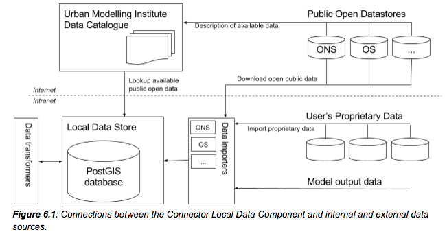

# Tombolo Digital Connector

The Tombolo Digital Connector is a piece of software to combine urban datasets
and urban models.

## Table of Contents:

* [Quick start](#quick-start)
* [Continuous Integration](#continuous-integration)
* [System Architecture](#system-architecture)
* [Data model](#data-model)

## Quick start

### Requirements
* PostgreSQL (9.4+)
* PostGIS (2.1+)
* Gradle (2.12+)
* (Optional) Wercker (1.0+)

### Set up main database

First copy and amend the example configuration file at
`/gradle.properties.example` to
`/gradle.properties`.

To create a user and database with the default values in the example file:

```bash
# Omit if you have set up your own database

createuser tombolo
createdb -O tombolo tombolo
psql -d tombolo -c "CREATE EXTENSION postgis;"
```

The following scripts will delete the existing tables in the tombolo database
and create a new empty copy, with some initial fixtures.

```bash
# Create DB tables and load initial fixtures

psql -d tombolo -U tombolo < src/main/resources/sql/create_database.sql
psql -d tombolo -U tombolo < src/main/resources/sql/initial_fixtures.sql
```

### Set up test database

The test database is used by the tests and is cleared routinely. We use this
to gain control over what is in the database when our tests are running and
to avoid affecting any important data in your main database.

To create the test user and database:

```bash
# Omit if you have set up your own database

createuser tombolo_test
createdb -O tombolo_test tombolo_test
psql -d tombolo_test -c "CREATE EXTENSION postgis;"
```

The following scripts will delete the existing tables in the tombolo_test database
and create a new empty copy, with some initial fixtures.

```bash
# Create DB tables and load initial fixtures

psql -d tombolo_test -U tombolo_test < src/main/resources/sql/create_database.sql
psql -d tombolo_test -U tombolo_test < src/test/resources/sql/initial_fixtures.sql
```

### Run tests

```bash
gradle test
```

If you use the IntelliJ JUnit test runner, you will need to add the following to your
VM Options in your JUnit configuration (Run -> Edit Configurations -> All under JUnit,
and Defaults -> JUnit):

```
-Denvironment=test
-DdatabaseURI=jdbc:postgresql://localhost:5432/tombolo_test
-DdatabaseUsername=tombolo_test
-DdatabasePassword=tombolo_test
```

### Run export

We use the Gradle task `runExport` to run exports. The parameters are as follows:

```bash
gradle runExport \
    -PdataExportSpecFile='path/to/spec/file.json' \
    -PoutputFile='output_file.json' \
    -PforceImports='com.className'
    -PclearDatabaseCache=true
```

For example, this exports the London borough profiles from OrganiCity to `organicity-borough-profiles.json`:

```bash
gradle runExport \
    -PdataExportSpecFile='src/main/resources/executions/organicity/export-borough-profiles.json' \
    -PoutputFile='organicity-borough-profiles.json'
```

Or without Gradle:

```bash
gradle clean build copyDeps -x test
java -cp "build/libs/TomboloDigitalConnector.jar:build/dependency-cache/*" \
    -Denvironment=export \
    -DdatabaseURI=jdbc:postgresql://localhost:5432/tombolo \
    -DdatabaseUsername=tombolo \
    -DdatabasePassword=tombolo \
	uk.org.tombolo.DataExportRunner \
	src/main/resources/executions/organicity/export-borough-profiles.json \
	organicity-borough-profiles.json \
	"" \
	true
```

### Build

With or without running the unit tests

```bash
gradle clean build copyDeps
gradle clean build copyDeps -x test
```

For Eclipse users the following command builds

```bash
gradle cleanEclipse eclipse
```

## Continuous Integration

We're using [Wercker](http://wercker.com/) for CI. Commits and PRs will be run
against the CI server automatically. If you don't have access, you can use the
Wercker account in the 1Password Servers vault to add yourself.

If you need to run the CI environment locally:

1. Install the [Wercker CLI](http://wercker.com/cli/install)
2. Run `wercker build`

The base image is generated with the very simple Dockerfile in the root of this
project. To push a new image to DockerHub you will need access to our DockerHub
account. If you don't have access, you can use the DockerHub account in the
1Password Servers vault to add yourself.

If you need new versions of PostgreSQL, Java, etc, you can update the image:

```
docker build -t tombolo .
docker images
# Look for `tombolo` and note the IMAGE ID
docker tag <IMAGE_ID> fcclab/tombolo:latest
docker push fcclab/tombolo
```

## System Architecture




## Data model

**Provider** is a data object representing sources of data. 
A provider could be a governmental source of data, such as ONS; 
or a private but publicly available data source, such as Twitter feeds. 
In the future we may extend it to represent internal processes for aggregating or manipulating data, 
such as a process that aggregates age distribution data from the ONS Census 
and generates statistics on the fraction of the population that is 65 or older.

* _label:_ a unique label for the provider
* _name:_ a name of the provider


**Subject** is a data object representing any type of subject or entity, 
which can include geographic objects, individuals and businesses. 

* _label:_ a unique label for the subject.
* _name:_ a name of the subject.
* _entity type:_ type of the subject (e.g. point, street segment, building, lsoa, msoa, local authority, individual, business, etc.)
* _geometry:_ in case the subject has an associated geometry

**Attribute** is a data object representing anything that could be measured or calculated, 
such as population density, CO2 concentration, obesity rate, etc. 
There are two fundamentally different types of attributes: 
Prime Attributes representing data that is imported from data providers; 
and Derived Attributes representing data that has been derived by processes running within the Digital Connector.
Currently we only support Prime Attributes in our implemntation, 
but going forwared we might extend it to handle Derived Attributes.

* _provider:_ For prime attributes this refer to the organisation or source of the data values for this attribute. 
For derived attributes this refers to the internal process that generated the values for this attribute.
* _label:_ a label of the attribute, unique for each provider
* _name:_ name of the attribute (e.g. Population density, Obesity rate, CO2 concentration, etc.)
* _datatype:_ datatype of the attribute (e.g. integer, float, string, etc.)

**Timed Value** is a data object representing the value of an attribute for a certain subject, taken at a certain time point.

* _subject_id:_ foreign key to a Subject
* _attribute id:_ foreign key to Attribute
* _timestamp:_ time point (or interval) to which the value refers (e.g. 2015-03-04T10:33:44Z, 2015, March 2015, etc.)
* _value:_ the actual value


## Useful database queries

This sections contain a number of useful database queries that should at some point be integrated into the connector main code

```bash
psql tombolo -c 'select subject_type_label, count(*) from subject group by subject_type_label'
```

Attributes
```bash
psql tombolo -c 'select provider_label, label, name from attribute'
```

Attribute and value count per subject type
```bash
psql tombolo -c 'select subject_type_label, count(distinct a.id), count(distinct value) as values from timed_value as tv left join subject as go on (tv.subject_id = go.id) left join attribute as a on (tv.attribute_id = a.id) group by subject_type_label'
```

Attribute and value count per subject type and provider
```bash
psql tombolo -c 'select subject_type_label, provider_label, count(distinct a.id), count(distinct value) as values from timed_value as tv left join subject as go on (tv.subject_id = go.id) left join attribute as a on (tv.attribute_id = a.id) group by subject_type_label, provider_label'
```

### Database geo unit transformation

This command might come handy when we start writing the data exporters

```bash
psql -d tombolo -c 'SELECT name, ST_AsGeoJSON(shape) from subject where limit 1'
```