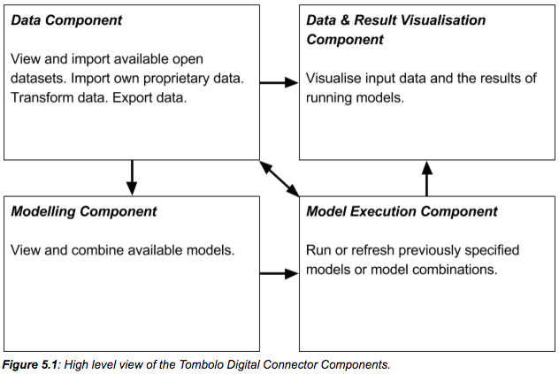
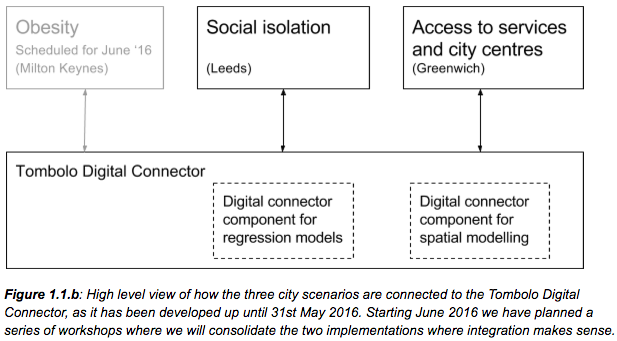

# Tombolo Digital Connector System Arcitecture

Figure 1 shows a high level architecture in terms of system components and the interlinking between them. At the core of the digital connector is the Local Datastore where all incoming data is stored in a centralised data format. Importers are responsible for interpret the incoming data and code it in the centralised data format. We have both built-in importers for publicly available datasources as well as support for users to write their own importers for their proprietary data. Exporters are used to export data from the system. The output data can be of simple data values as they originated in the input data, or as a modelled combinations of various data-sources. For the modelling part we both have pre-defined built-in models as well as support for the user to specify and export their own proprietary models.

___Figure 1:___ _Overview of the Tombolo Digital Connector components and data workflow._

## Local Datastore
See [description of our data model](DataModel.md).

## Importers
T.b.a.

## Fields and Models
T.b.a.

## Exporters
T.b.a.

## How we use the Digital Connector for various use-cases
In discussion with our partner local councils we have identified 3 city challenges where we will apply the Digital Connector. For each local council we have been exploring a “soft” topic. For each city we have gone through several iterations and refined the “soft” topic. In Milton Keynes we initially set out to explore obesity but in successive reiterations we have pivoted towards exploring active transport. In Leeds started with the problem of social isolation among the elderly population. Through discussion with our main contact in Leeds and a workshop with members of the local council we have generalised the scope to exploring various metrics of community resilience. In Greenwich we have been exploring the issue of access to services and city centres. We have started with city centres and will extend it to other types of services. 

Apart from these three use cases for the Tombolo collaborating cities we have applied the Digital Connector to support various internal projects of the Future Cities Catapult. One example being OrganiCity where we among other things use the Digital Connector to create a data profile for London Boroughs, joining several data sources.

Figure 1.1 shows a simplified overview of how the 3 city challenges are built on top of the Digital Connector. The applications or interfaces for the 3 challenges will be developed fairly independent of each other, but relying as much as possible on a common implementation of the Digital Connector. The “interface” for each application can vary from being a static report with the main findings of running a model combination, to an interactive application where the user can visualize the effect of changing model features and parameters. 

___Figure 1.1:___ _High level view of how the three city scenarios are connected to the Tombolo Digital Connector._
